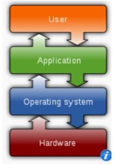

# 1장 운영체제

## 1. 운영체제 할 일?
컴퓨터와 컴퓨터 사용자 간의 중재자 역할 

### 1. 컴퓨터 시스템 구조
* 하드웨어 - CPU, Memory, I/O Device
* 운영체제 - 새용자와 App간 제어 조정
* 사용자 프로그램 및 응용 프로그램
* 사용자 - 사람, 기계

### 2. 사용자 관점
사용자가 누구냐에 따라 관점이 달라진다.
* 독점의 한 사용자 경우 - 자원의 이용에는 신경쓰지 않고 최적화 하는 일에 집중
* 대형 컴퓨터/ 미니 컴퓨터 터미널 - 자원이용에 극대화 하도록 설계
* 서버 - 자신 전용자원도 가지지만 공유하는 자원도 있기 때문에 두 가지가 조화를 이루어야함
* 모바일 컴퓨터 - 배터리 소모를 피하기 위해 최적화

### 3. 시스템 관점
운영체제는 하드웨어와 밀접하게 연관된 프로그램.
* 운영체제 = **자원할당자**
  * 자원의 관리자로서 특정 프로그램과 사용자에게 자원을 할당해줌.
  * 자원에 대해 상충 될 수도 있기 때문에 효율적이고 공정하게 할당해야함.

* 운영체제 = **제어프로그램**
  * 컴퓨터의 부적절한 사용 방지를위해 제어를 함. 특히 입출력 장치에 제어와 작동에 깊이 관여

## 2. 컴퓨터 시스템 구성

### 1. 컴퓨터 부트 시작 순서
1. 전원을 키거나 재부트될 때 실행
2. Firmware로 Rom 또는 EPROM에 저장된다(휘발)
3. 시스템 모든 장치를 초기화 한다.
4. 운영체제 커널을 메모리에 적재한다
5. 운영체제는 첫 번째 프로세스를 실행하고, event 발생을 기다린다.

### 2. 인터럽트(interrupt)
* 하드웨어나 소프트웨어에서 어떤 사건이 발생하면 인터럽트를 통해 시스템에 알린다.
* CPU가 인터럽트 되면, CPU는 하던일을 멈추고 고정된 위치로 실행을 옮긴다.
 

* 인터럽트 벡터 - 인터럽트 서비스 루틴의 주소를 제공  
 
인터럽트 처리가 끝나면 인터럽트 당한 명령어로 실행이 옮겨감

 

### 3. 저장장치 구조
컴퓨터 구조수업 에서 정리
https://github.com/i3629i/COA

### 4. 컴퓨터 시스템 구조 

#### 1. 다중처리 시스템
* 비대칭적 다중처리
 * 하나의 주 처리기가 시스템을 제어한다.
 * 다른 처리기들은 주 처리기 명령을 수행하거나 미리 정의된 태스크를 수행
 * 주종관계
* 대칭적 다중처리기
 * 모든 처리기가 대등
최근에는 다중 처리기 칩(멀티코어) 아용
 

#### 2. 클러스터링 시스템
 
* 저장 장치를 Storage area network으로 공유해 연결
* 일부 고장이 나도 사용가능
 * 비대칭형 클러스터 - 한 컴퓨터 긴급 대기모드상태
 * 대칭형 클러스터 - 여러 개의 노드가 애플리케이션을 수행해 서로 감시
* 고성능 계산에 사용

### 5. 운영체제 구조

#### 1. 다중 프로그래밍
* CPU가 항상 하나 이상의 작업을 실행하게 구성
* CPU가 항상 처리할 작업이 항상 있다.
* 작업을 기다릴때, 운영체제는 다른 작업을 실행한다.
**다중 프로그래밍은 작업을 기다리는 과정 없이 다른 작업으로 전환해 CPU가 최대한 쉬지 않게 하기 위함이다.**

#### 2. 시분할 시스템
CPU의 처리시간을 아주 짧게 세분화 하여 각 프로그램에 할당하여 마치 독점하고 있는 것 처럼 사용
* 프로세서를 통해 다중작업을 교대로 수행
* 사용자와 시스템 간의 직접적인 통신을 제공하는 대화식
* 다수의 작업을 빈번하게 교대하기 위해 응답시간이 1초 이내여야 한다.
* 실제론 다수의 사용자가 하나의 컴퓨터를 공유한다.
 

1. 프로세스 스케줄링과 다중 프로그래밍을 사용해 각 사용자에게 컴퓨터의 CPU를 시간적으로 분할하여 나눠줌.
2. 하나의 CPU를 나누어 쓰는 방식
