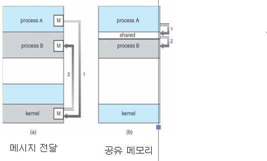
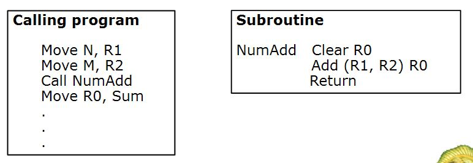
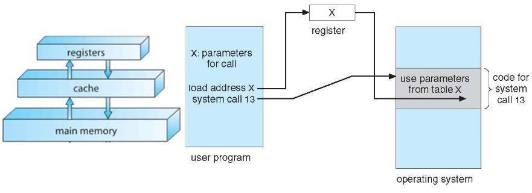

# 운영체제 2장

## 1. 운영체제 서비스
운영체제는 사용자 업무를 수행하는데 필요한 기능을 제공하고 시스템의 효율적인 운영을 보장한다.

### 사용자 업무를 수행하는데 필요한 기능을 제공

### 1. 사용자 인터페이스
* CLI(Command Line Interface) - 문자열 명령을 입력, cmd같은
* Batch Interface - 명령어를 파일 형태로 입력
* GUI(Graphical User Interface) - 그림문자(아이콘) 아용, 가장 보편적

### 2. 프로그램 실행
프로그램을 메모리에 적재해 실행할 수 있어야 한다.

### 3. 입출력 연산
수행 중인 프로그램은 입출력을 요구할 수 있다. 

### 4. 파일 시스템 조작
* 파일 읽고 쓰기
* 파일과 디렉토리 생성과 삭제
* 파일 정보 보기
* 파일 접근 권한 관리

### 5. 통신
* 동일한 컴퓨터 또는 네트워크로 연결된 컴퓨터에 있는 프로세스 간에 정보를 교환할 수 있다.
* 통신은 **메시지 전달**(정보의 패킷이 운영체제에 의해 프로세스들 사이를 이동) 기법 또는 **공유 메모리**를 통해 구현 된다.

### 6. 오류 탐지
* 모든 가능한 오류를 항상 의식하고 있어야 한다.
* 운영체제는 각 유형의 오류에 적당한 조치를 취해야 한다.

### 시스템 자원을 공유하여 시스템의 효율적인 운영을 보장하는 서비스

### 1. 자원 할당
* 다수의 사용자나 다수의 작업들이 동시에 실행될 때, 각각의 자원을 할당해야 함
* CPU를 최대한 효율적으로 이용하기 위해 CPU스케쥴링, 속도, 레지스터 수 다른 요인을 다 고려해야 한다.

### 2. 회계
* 사용자가 어떤 자원을 얼마 만큼 사용하는지 추적해 기록하고 관리한다.

### 3. 보호와 보안
* 보호 - 시스템 자원에 대한 모든 접근이 통제 되도록 보장하는 것
* 보안 - 외부 입출력 장치들을 부적합한 접근 시도로부터 지키고, 침임의 탐지를 위해 모든 접속을 기록.
보호되고 보안이 유지되려면 시스템 전체에 **예방책**이 제정되야함.

## 2. 사용자 운영체제 인터페이스

### 1. 명령 해석기(Command Interpreter)
직접 명령어를 입력해야 한다.
* 여러 명령어 해석기 Shells제공
* 사용자가 지정한 명령을 가져와서 그것을 수행함.
* UNIX같은 경우 명령어를 메모리에 적재되어 실행될 파일을 식별하기 위해 명령을 사용한다.

### 2. GUI
* 명령어를 입력하는 것이 아닌 아이콘을 이용해 실행
* 인터페이스 내의 다양한 마우스 버튼으로 여러 명령 실행가능. ex) 오른쪽 클릭
 많은 시스템이 CLI와 GUI인터페이스를 모두 가지고 있다.

### 3. 시스템 호출
* 운영체제가 제공하는 서비스에 대한 인터페이스를 사용자에게 제공.
* 호출은 일반적으로 C or C++로 작성된 루틴 형태로 제공사용
* 사용자 프로그램 실행 -> API 사용 -> 시스템 호출
API는 말그대로 응용 함수

하 너무어렵다..여기 뭔 말이야 도대체...진짜..계속 읽어도 모르겠네 ㅡㅡ...
일단 스킵..

## 3. 시스템 호출 매개변수 전달

1. 매개변수를 레지스터에 전달
  * 레지스터 숫자보다 더 많은 매개변수가 있을 경우 레지스터만으로 부족
 
2. 매개변수가 메모리에 있는 블록, 테이블에 저장된다.
  * 블록의 메모리 주소가 레지스터에 매개변수로 전달.
 

3. 스택에 넣어지고 운영체제에 의해 꺼내진다.

------------------------------------------------------------------------------

내용이 너무 딱딱하고 어떤 기능 및 기계적인 내용위주로 많이 나와있어 나중에 정리하기로 함.
교수님 집어주는 부분 정리하자..1,2장은..

