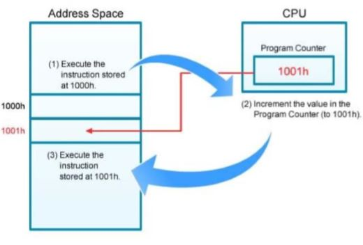

# 운영체제 1장

## 5. 운영체제 연산
현대 운영체제는 **인터럽트 구동식** 이다.
* 인터럽트나 트랩을 발생시켜 신호를 보낸다.

운영체제와 사용자는 하드웨어와 소프트웨어의 자원을 공유하기 때문에 사용자 프로그램 오류가 현재 수행중인 프로그램에만 
문제를 일으키도록 보장해야함.

### 1. 이중 연산 모드
사용자 모드와 커널모드(슈퍼 바이저 모드)를 필요로 함.
* 운영체제를 위해 실행되는 작업과 사용자를 위해 실행 되는 작업을 구분.
* 시스템 서비스를 호출시 커널 모드가 바뀌고 호출이 끝나면 사용자 모드로 돌아감.
* 특권 명령을 지정해 보호함.

### 2. 타이머
사용자 프로그램이 무한 루프에 빠지거나 시스템 서비스 호출에 실패해 제어가 운영체제로 복귀 하지 않는경우가 없도록
**타이머**를 사용.
* 지정된 시간후 인터럽트를 설정
* 계수기가 0 이 될 때 인터럽트 발생. 클록이 똑딱 할 때 계수 감소
* 타이머 인터럽트 발생시 운영체제가 제어 - 프로그램 중단 or 시간 할당

## 6. 프로세스 관리
* 실행 중인 프로그램 = 프로세스
* 프로세스가 끝나면, 운영체제는 재사용 할 수 있는 자원을 회수 한다.

### 1. Program Counter
단일 스레드 프로세스
* 다음 실행할 명령어의 주소를 가지고 있음.
* 프로세스가 완료 될 때까지 명령어 들은 순서적으로 한 개씩 실행 
다중 스레드 프로세스 
* 스레드 당 한 개의 PC를 갖는다.
 

## 7. 메모리 관리
모든 자료는 처리 전과 후에 메모리에 있게 된다.
* CPU가 명령을 수행하기 위해서는 주 메모리에 내에 있어야 한다.
 
운영체제 메모리관리
* 메모리의 어느 부분이 현재 사용되고 있는지 누구에 사용 되는지 추적
* 어떤 프로세스를 메모리에 적재하고 제거할지 결정
* 필요에 따라 메모리 공간을 할당 회수

## 8. 저장장치 관리

### 1. 파일 시스템 관리
저장 장치의 저장 단위인 파일을 정의
* 제어 통제가 누가 어떤 자료를 접근 할 수 있는지 결정

### 2. 대용량 저장장치 관리
메인 메모리에 넣을 수 없는 자료, 오랜 기간 저장해야 하는자료

### 3. 캐싱(Caching)
CPU내부에서 캐시메모리로 사용한다
* 캐시는 주 기억장치보다 빠르게 실행
* 캐시에 없을 시에 주 메모리 시스템으로 정보를 가져와서 사용.
캐시 중요

### 4. I/O 시스템
* 입출력 메모리 관리
* 일반적인 장치 드라이버 인터페이스

## 9. 보호와 보안

### 1. 보호
컴퓨터 시스템이 정의한 자원에 대해 프로그램, 프로세스 사용자들의 접근을 제어

### 2. 보안
외부 또는 내부의 공격을 방어

