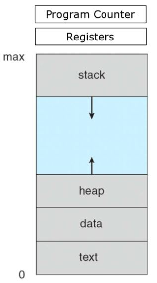
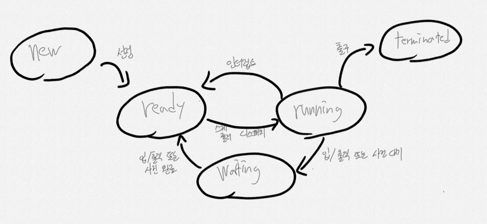
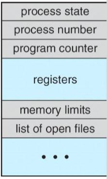
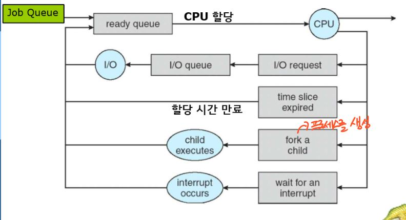
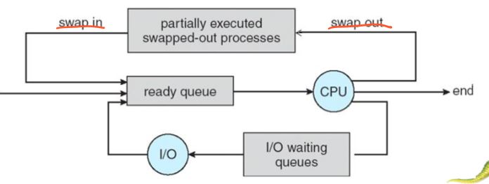
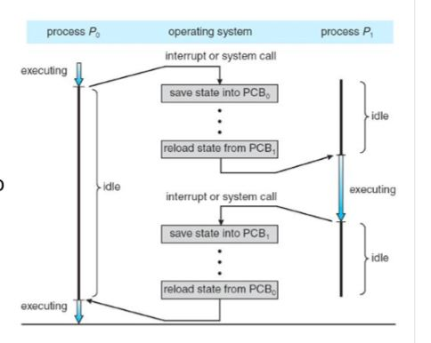
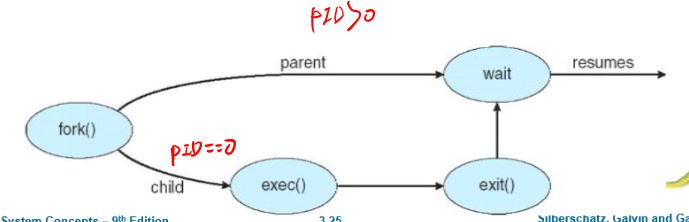

# 프로세스

## 1. 프로세스 개념

### 1. CPU활동을 어떻게 부르는가?
* BatchSystem(일관 처리 시스템) - Jobs
* Time-shared System(시분할) - Tasks or 사용자 프로그램

### 2. Process
모든 CPU활동을 모두 프로세스라고 부른다. 즉 실행중인 프로그램

* 프로그램은 - 수동적 존재, 그 자체
* 프로세스는 - 능동적 이며, 실행중인
* 프로그램은 GUI 마우스 클릭, Command line 입력으로 실행된다.
* 하나의 프로그램은 다양한 프로세스들을 가진다.

### 3. Process in Memory

* Program counter - 다음 명령어 주소
* Process registers - 데이터 저장
* Stack - 함수의 매개변수, 복귀주소, 로컬 변수 스택
* Heap - 프로세스 실행 중에 동적으로 할당되는 메모리인 힙을 포함.
* data
* text - 프로그램 코드

### 4. 프로세스 상태(중요)

* New - 프로세스 생성 중
* Ready - 프로세스가 처리기에 할당되길 기다림.
* Running - 명령어들이 실행되고 있음.
* Waiting - 프로세스가 어떤 사건(입출력 완료 또는 신호의 수신)이 일어나기를 기다림
 어느 한 순간 한 처리기 상에서 오직 하나의 프로세스만 실행 된다는 것을 인식.

### 5. 프로세스 제어 블록(PCB)
프로세서의 정보가 들어있는 것을 PCB라고 한다.

 
* Process state - 프로세스의 상태를 나타냄 running, waiting
* Process ID
* PC(Program counter) - 다음 실행할 명령어의 주소를 가지고 있음.
* CPU Registers - 레지스터에는 누산기, 인덱스, 스택, 범용 레지스터들과 상태 코드가 포함된다. 프로세스가 올바르게 실행되도록 
위해 인터럽트 발생시 저장 되어야 한다.
* CPU Scheduling - CPU스케쥴링 정보를 가지고 있다.
* Memory
* Accounting information
* I/O
 위의 정보들을 가지고 있는 것을 PCB(Process Control Block)이라고 한다.

### 6. 스레드(Thread)
현대 운영체제 에는 다수의 실행 스레드를 가질 수 있도록 허용한다.ex) MS워드 프로세서 프로그램에서 여러가지 일을 동시에 처리 가능.
* 스레드를 지원하는 시스템 에서는 PCB는 각 스레드에 관한 정보를 포함하도록 확장된다.
* 스레드는 프로세스보다 작은 독립된 실행 단위 - 이로써 동시에 실행이 가능하다.

## 2. 프로세스 스케쥴링
* 프로그래밍의 목적은 CPU를 쉬지 않고 일을 시키는 것.
* 시분할의 목적은 프로세스들 사이에서 CPU를 빈번하게 교체해 CPU사용을 극대화 시키는 것.
* 프로세스 스케줄러는 Ready된 여러 프로세서들 중에서 하나의 프로세서를 선택한다.

### 1. 스케쥴링 큐

1. 프로세스사 시스템에 들어오면 Job Queue에 놓여진다. - 주 메모리에 존재
2. 준비 완료 상태인 큐를 Ready Queue로 부른다.
3. 준비 완료큐 헤더는 리스트의 첫번째와 마지막 PCB를 가리키는 포인터를 포함한다.
4. CPU가 할당되어 실행하면, 여러 사건이 발생한다.
  * 압출력 요청 입출력 큐에 넣어질 수 있다
  * 프로세서가 새로운 자식을 생성하고 자식프로세서의 종료를 기다림
  * 프로세서가 인터럽트의 결과에 의해 강제로 CPU로부터 제거되고, 다시 준비 완료 큐에 놓임.
5. 프로세서는 종료될 때 까지 이 주기를 반복한다.
6. 종료시 모든 큐에서 삭제되고 자신의 PCB와 자원을 반납한다.

### 2. 스케줄러
* 장기 스케쥴러(Long-term-scheduler)
  * 이제 시작하는 프로세서들을 선택하여 실행, Ready큐에 넣을 프로세서를 선택
  * 비교적 실행 빈도수가 적다.
  * 다중 프로그래밍 정도를 제어 한다.
  * 실행 간격이 비교적 크기 때문에, 실행할 프로세스를 선택하는데 더 많은 시간을 사용해도 된다.
* 단기 스케쥴러(Short-term-scheduler)
  * 실행 준비가 완료되어 있는 프로세서들중 선택
  * **단기 스케쥴러는 빈번히 실행되어 반드시 빨라야 한다.**
 

* 입출력 중심 프로세스
  * 연산보다 입출력 실행에 더 많은 시간을 소요함.
* CPU 중심 프로세스
  * 연산에 시간을 더 소요함. 입출력이 드물다.
 
두 가지 특징이 적절한 혼합이 필요함
 

* 중기 스케쥴러
  * 다중 프로그래밍의 정도를 조정하기 위해 사용할 수 있다.
  * 스와핑 기법 - 메모리에 있는 프로세서를 제거하여 디스크에 넣고, 나중에 다시 불러드리는

### 3. 문맥 교환(Context Switch)
인터럽트가 발생했을때 인터럽트 처리가 끝난 후에 문맥을 복구 할 수 있도록 현재 실행 중인 프로세스의 문맥을 저장해
다시 돌아올 때 불러오는 기법 

1. 과거 프로세스의 문맥을 PCB에 저장한다.
2. 실행할 프로세서 PCB정보를 불러와 실행한다.
3. 실행한 프로세서 문맥을 실행한 PCB에 저장하고
4. 과거에 저장한 프로세스 문맥을 다시 불러온다.(복구)
* 문맥이 교환되는 동안 아무런 일을 못하고 있기 때문에 낭비가 된다.(Over head)

## 3. 프로세스에 대한 연산

### 1. 프로세스 생성
* 프로세서는 여러 개의 새로운 프로세스들을 생성 할 수 있다.
* 생상하는 프로세세를 **부모**, 새로운 프로세스를**자식**
* **PID** 프로세스 식별자를 이용해 프로세스를 구분한다.

 

* Resource sharing 방법
  1. 부모와 자식의 자원을 모두 공유한다
  2. 부모의 자원중 일부를 자식에게 공유한다.
  3. 자원을 공유하지 않는다.
  
* 새로운 프로세스를 생성할때, 두 프로세스를 실행 시키는데 두 가지 가능한 방법
  1. 부모와 자식을 동시에 실행한다.
  2. 자식이 종료될 때 까지 부모가 기다린다.

* 새로운 프로세스 들의 주소 공간 측면에서 볼 때 두 가지 가능성
  1. 자식 프로세서는 부모 프로세서의 사본이다(자식 프로세서는 부모와 똑같은 프로그램과 데이터를 가짐)
  2. 자식 프로세스가 새로운 프로그램을 가져옴.
  
### 2. UNIX 운영체제 예시
  * fork() - 새로운 프로세스를 fork로 생성
    * 반환값 : 부모 - 자식 프로세스 PUD , 자식 - 0
  * exec() - 자신의 메모리 공간을 새로운 프로그램으로 교체하고 실행.
 
 main(){
 int pid;
 
 pid = fork(); // 새 프로세스를 생성한다
 
 if (pid<0){ // pid가 0보다 작으면 오류 발생
  오류메시지
  return 1;
 }
 else if (pid == 0 ) { //pid가 0 이면 자식 프로세스
  execlp(~~)
 }
 else { //부모가 자식이 완료되기를 기다림.
  wait();
 }
} 

