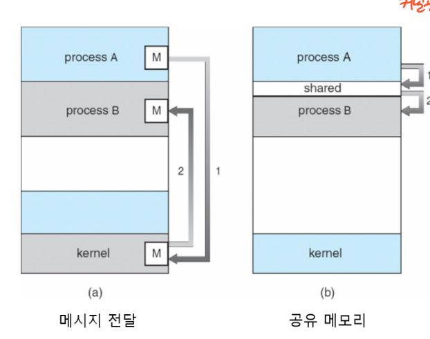
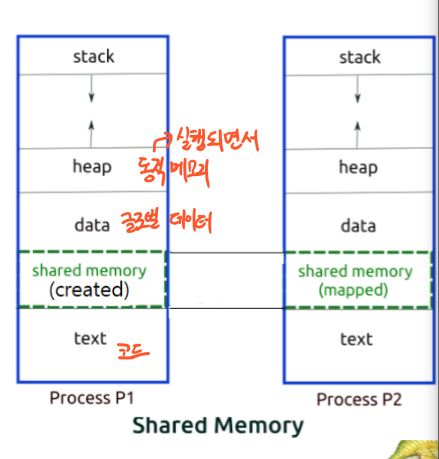
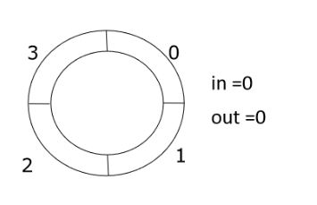
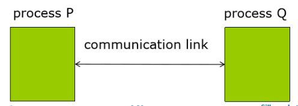
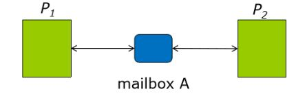
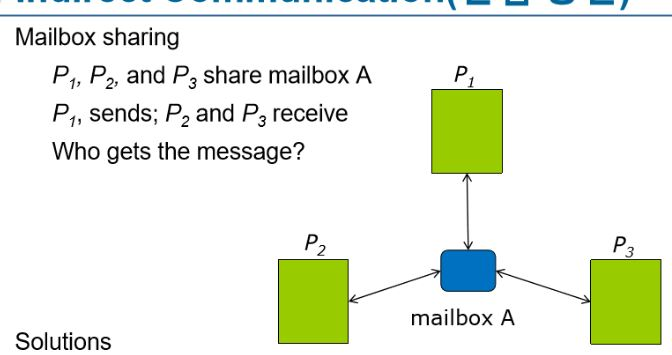
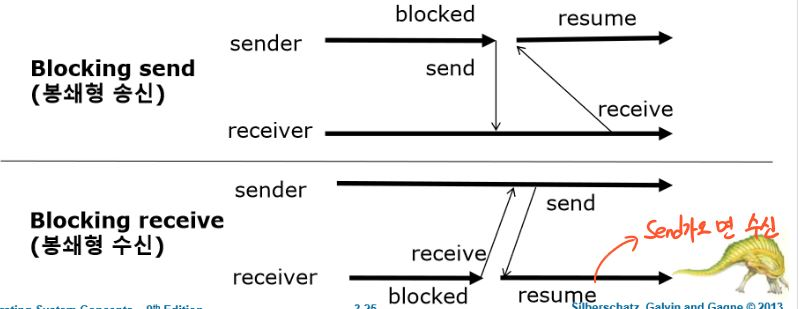
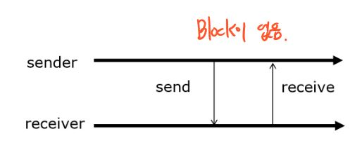

# 프로세스 개념

## 4. 프로세스간 통신

운영체제 내에서 실행되는 프로세서는 **독립적** or **협력적**
* 독립적 - 다른 프로세서와 데이터를 공유하지 않음
* 협력적 - 프로세서가 다른 프로세서에게 영향을 주는 
  * 정보 공유 - 정보 접근이 병행적 환경
  * 계산 가속화
  * 모듈성 - 별도의 프로세스들 또는 스레드로 나누어, 모듈식 구성
  * 편의성 - 작업양이 많을 경우 병렬로 수행 가능

 
* 공유메모리 - 공유되는 메모리 영역이 구축
  * 커널에 간섭등 시간 소비 작업이 적어 메시지 전달보다 빠름
  * 공유 메모리 영역만 구축할 때 시스템 호출이 필요.
* 메시지 전달 - 프로세스들 사이에서 메시지를 교환하면서 통신을 한다.
  * 적은양의 데이터를 교환
  * 공유메모리보다 구현이 쉬움.
  
### 1. 공유메모리

* 프로세스간 통신하는 프로세서들이 공유 메모리 영역을 구축해야한다.
* Shared Memory영역에 통신하고자 하는 프로세스의 주소를 추가한다.

#### 1. 유한 버퍼 - 공유메모리 해결책

Buffer_Size = 4 // 버퍼의 최대 크기가 4이다. 

int in = 0; // in : 버퍼 내의 비어있는 다음 요소 
int out = 0; // 버퍼 내에서 사용중인 첫 번째 요소 
 

in == out; // 버퍼가 비어 있음 
((in+1) % Buffer_size) == out; // 버퍼가 다 차 있음 

 
Buffer_Size만큼 사용하지 못하는 이유는 무엇 인가??

* Buffer_size가 4일때 0,1,2,3 모두 가득 차있다고 생각하자, 그럼 다음 in 은 0이 될 것이다 in == out, 0 == 0 비어 있는 줄 알고 자료를 넣게되면 삭제가 된다.

### 2. 메시지 전달 시스템
통신 연결이 설정되어 있어야한다. Send()/receive()연산을 논리적으로 
* 직접 또는 간접 통신
* 동기식 또는 비동기식 통신
* 자동 또는 명시적 버퍼링

#### 1. 명명

**직접 통신 Direct Communication**
* send(P, message) - 프로세스 P에게 메시지를 전송한다.
* receive(Q, message) - 프로세스 Q로부터 메시지를 수신한다.

* 통신하는 프로세스들 각 쌍 사이에는 정확하게 하나의 연결이 존재한다.
* 서로의 신원만 알면 통신이 가능하다.

**간접 통신**

* 간접통신은 메일박스 또는 포트로 송신된다.
* 두 프로세스들이 공유 메일박스를 가질 때만 프로세스가 통신 가능하다.
 

P1 == sends, P2,P3 == receive일때, 누가 메시지를 받는가?
* 한 순간에 최대 하나의 프로세스가 receive를 받는다.
* P2,P3중 누가 받는지는 시스템이 임의로 선택하도록 한다. 둘중 하나만 받음.

운영체제가 한 프로세스에 허용하는 기법 
* 새로운 메일박스를 생성한다
* 메일박스를 통해 메시지를 송수신한다
* 메일박스를 삭제한다

#### 2. 동기화
메시지 전달은 봉쇄형(Blocking)과 비봉쇄형(Non-blocking)으로 전달

**봉쇄형**

* 봉쇄형 송신 - 메시지가 수신 될 때 까지 막아버림.
* 봉쇄형 수신 - 메시지가 이용 가능할 때까지 수신을 막음.

**비봉쇄형**

#### 3. 버퍼링
직접 간접 모두 프로세스 간에 교환되는 메시지가 임시 큐에 들어감.

**3가지 방법**
* 무용량 - 용량이 없어서 대기할수가 없음
* 유한용량 - 최대 N의 메시지가 안에 들어갈 수 있다. 
* 무한용량 - 얼마든지 메시지들이 큐 안에서 대기 할 수 있다.
