# 쓰레드 threads

## 1. 개요
* 스레드는 CPU의 기본 이용 단위
* 스레드ID, 프로그램 카운터, 레지스터 집함, 스택으로 구성 됨.
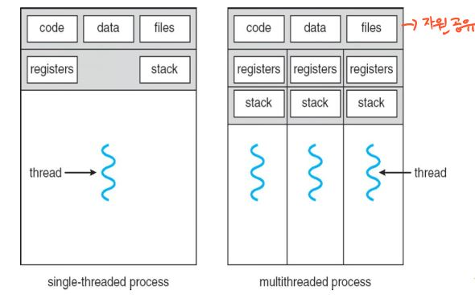 
* 만일 프로세스가 다수의 제어 스레드를 가진다면, 하나 이상의 작업을 동시에 실행 할 수 있다.

### 1. 동기
현대 프로세서들은 대부분 다중 스레드를 사용한다. -> 워드에선 그래픽표현과 키보드입력 2가지 스레드

* 멀티스레드 서버의 구조
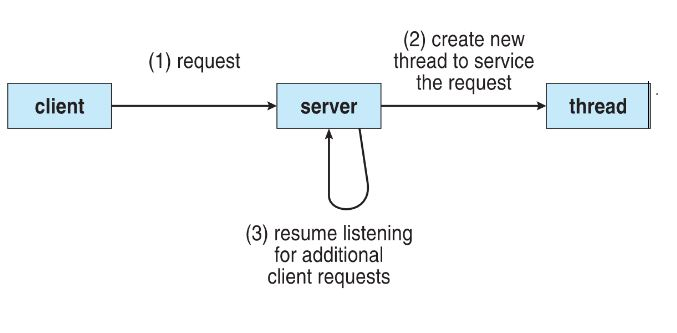 
1. 클라이언트가 서버에 요청을 한다.
2. 요청이 들어오면 서버는 클라이언트의 요청을 Listen하는 별도의 스레드를 생성한다.
3. 클라이언트의 Listen요청한 명령을 수행한다.

### 2. 다중스레드의 이점
* 응답성 - 하나가 Block되거나, 프로그램 수행이 길어도 수행을 계속 할 수 있다.
* 자원 공유 - 속한 프로세스의 자원들과 메모리를 공유한다.
* 경제성 - 메모리의 자원을 할당하는 것보다 스레드를 생성하고 Context Switch하는 것이 더 경제적이다.
* 규모적응성 - 다중 처리기 구조에서 각각의 스레드가 다른 처리기에 병렬로 실행 가능.

## 2. 멀티코어 프로그래밍(Multicore Programming)
* 다중코어, 다중처리기 - 여러 개의 CPU칩, 한 개의 칩에 여러 개의 CPU

* 병렬 실행 - 여러 코어 에서는 개별 스레드를 각 코어에 배정해 병행성 스레드를 병렬적으로 실행.
* 병행 실행 - 하나의 코어는 오직 하나의 스레드만 실행 가, 단순히 시간에 따라 교대로 실행, 하나 이상의 태스크를 지원
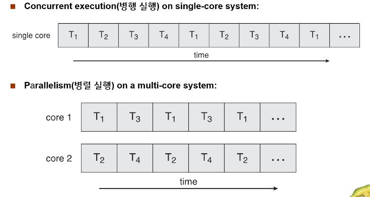 

### 1. 프로그래밍 도전 과제
* 운영체제 설계자는 여러 코어 활용 하는 스케쥴링 알고리즘 개발
* 프로그래밍
  1. 태스크 인식
  2. 균형
  3. 데이터 분리
  4. 데이터 종속성
  5. 시험 및 디버깅
  * P193 운영체제
  
### 2. 병렬 실행의 유형
* **데이터 병렬 실행**
  * 동일한 데이터의 부분집합을 다수의 계산 코어에 분배한 뒤 각 코어에서 동일한 연산을 실행.
  * Ex) 0 부터 N까지 더한다 치자 여기서 듀얼 코어면 (0 부터 N/2 - 1 까지 더하고)  (N/2 부터 N 까지 더한걸) 더하면 데이터 병렬 실행
  
* **테스크 병렬 실행**
  * 태스크(스레드)를 다수의 코어에 분배한다.
  * Ex) 같은 식의 배열 통계 연산에서 실행하는데 같은 연산의 반복을 병렬로 실행
  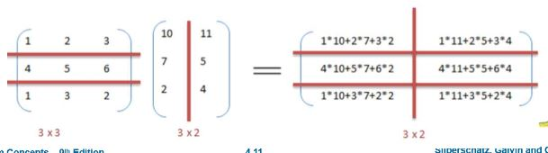 
 앞의 그림이 데이터 병렬, 뒤의 그림이 태스크 병렬 실행
 
### 3. 암달의 법칙(Amdahls's Law)(외울것)
순차 와 병행 요소 프로그램에 코어를 추가해서 얻을 수 있는 성능향상 공식.
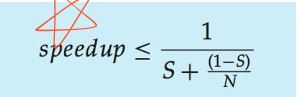 
* S : 순차 코드 부분
* 1 - S : 병렬 부분
* N : 처리 코어
예를 들어 75%의 병렬 실행 구성요소 25% 순차 실행 구성요소를 가진 Application있다고 가정. 코어가 2개인 시스템에서 실행할 경우
1.6배의 속도향상, 4개의 코어 에서는 2.28배 빨라진다.
* S = 0.25, 1-S = 0.75, N = 2(Core2개) 일때 1 / 0.25 + 0.75 / 2 = 1 / 0.625 = 1.16

## 3. 다중 스레드 모델
* 사용자스레드와 커널스레드
* 사용자 스레드는 커널 위에서 지원되며 커널 없이 관리된다
* 커널 스레드는 운영체제에 의해 직접 지원되고 관리된다.

### 1. 다 대 일 모델
많은 사용자 수준의 스레드를 하나의 커널 스레드로 사용
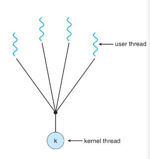 
* 한 번에 하나의 스레드만 커널에 접근 가능해 다중 스레드가 다중코어 시스템에 병렬로 실행 불가능.

### 2. 일 대 일 모델
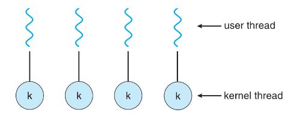 
* 다대일 모델보단 더 많은 병렬성을 제공한다
* 단점은 사용자 스레드를 생성할때 커널 쓰레드를 생성해 줘야하기 때문에 그에 따른 응용프로그램의 성능 저하가 된다.
* 윈도우XP/2000, 리눅스등 사용
### 3. 다 대 다 모델
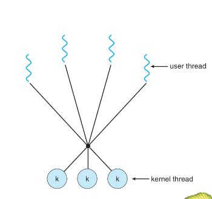 
* 여러 개의 사용자 수준의 스레드를 그보다 작거나 같은 커널 스레드로 연결함.

### 4. 다 대 다의 변형 두 수준 모델
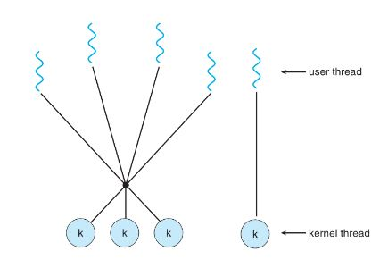 
* 다대다 모델을 허용 하면서 한 사용자 스레드가 하나의 커널 스레드만 연관되는 것을 허용

## 4.스레드 라이브러리
프로그래머에게 스레드를 생성하고 관리하기 위한 API를 제공한다.

### 1. 자바 스레드
1. 쓰레드 클래스의 메소드를 override 하는 방법
1. Runnable 인터페이스를 구현하는 클래스를 정의 하는것
ex) 
<pre>
class sum
{
Private int sum;

Public int getSum(){
  return sum;
}
Public void setsum(int sum){
  this.sum = sum;
  }
}

class Summeration implements Runnable
{
  private int upper;
  private Sum sumValue;
  
  public Summation(int upper, Sum sumvalue){
    this.upper = upper;
    this.sumValue = sumValue;
  }
  
  public void run(){
    int sum = 0;
    for(int i = 0; i <= upper; i++){
      sum += i;
      sumValue.setsum(sum);
    }
  }
}
<code>
* run()을 호출하지 말고 쓰레드 객체의 start() 메서드를 호출하여라. 그러면 알아서 run실행함
* getter,setter을 지정하는 이유는 값을 변경시켜주기 위해 Integer이면 값이 지정되면 변경할 수 없다

## 5. 암묵적 쓰레딩
스레딩의 생성과 관리 책임을 응용 개발자로 부터 컴파일러와 실행시간 라이브러리에게 넘겨주는 것.

### 1. 스레드 풀
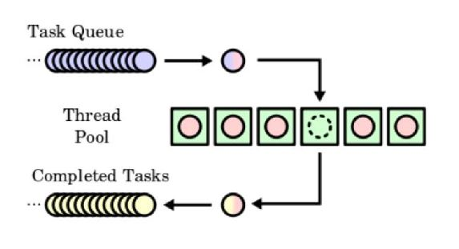 
#### 기존의 원인
* 첫 번째 서비스할 때마다 스레드를 생성하는데 소요되는 시간을 소화해주는 방법
* 스레드를 무한정 만들다보면 자원이 고갈되기 마련인데 이를 해결하는 방법

#### 원리
* 시작할때 아예 일정수의 스레드를 미리 풀로 만들어 놈
* 평소에 하는 일 없이 일감을 기다리고 요청이 들어오면 한 스레드에게 그것을 할당.
* 스레드 풀의 가용 스레드가 바닥나면 하나 생길 때 까지 대기한다.

#### 장점
* 새 스레드를 만들어 주기보다 빠르다.
* 스레드 개수에 제한을 둠으로써, 많은 스레드를 병렬 처리할 수 없는 시스템에 도움이 됨

### 2. OpenMP
공유 메모리 환경에서 병렬 프로그래밍 할 수 있도록 도음을 준다.

### 3. Grand Central Dispatch
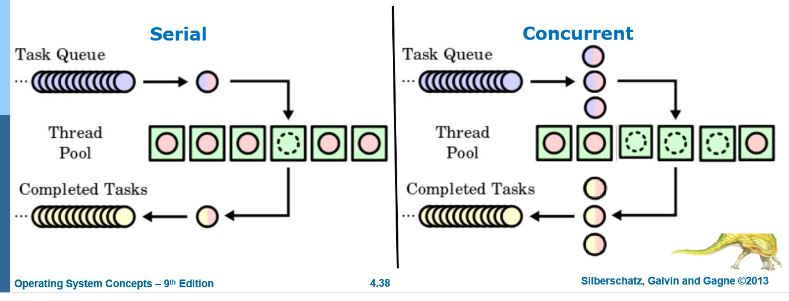 
* 직렬 큐 - FIFO순서대로 제거된다
* 병행 큐 - FIFO순서대로 제거 되지만 여러 블록이 동시에 제거 될 수 있다.

## 6. 스레딩 문제

### 1. Fork(), exec() 호출
#### fork
* 새로운 프로세스는 모든 스레드를 복제하는 경우
* fork()를 호출한 스레드만 복사하는 경우 2가지가 있다

#### exec
* exec의 매개변수로 지정된 프로그램이 모든 스레드를 포함한 전체 프로세스를 대체시킨다.

### 2. 신호처리
프로세스에 어떤 사건이 일어났음을 알려주기 위해 사용된다.

#### 방식
1. 특정 사건 발생
2. 신호가 프로세스에게 전달
3. 처리

* 동기식 - 불법적인 메모리접근, 0으로 나누기
* 비동기식 - 실행중인 프로세스 외부로 부터 발생되면

#### 신호 처리기
* 모든 신호마다 디폴트 신호 처리기가 있다
* 디폴트 처리기는 사용자 정의 신호 처리기에 의해 대체될 수 있다.

#### 어느 스레드에 신호를 전달하는지?
* 신호가 적용될 만한 스레드에 전달
* 모든 스레드
* 몇몇 스레드에게 선택적으로 전달
* 특정 스레드가 모든 신호를 전달받도록 지정

### 3. 취소
스레드가 끝나기 전에 강제 종료시키는 작업.
* 목적 스레드 - 자신이 원하는 데이터를 찾아 다른 스레드를 취소 시키고 싶을때 사용

#### 목적 스레드의 두가지 방식
* 비동기식 취소 - 한 스레드가 즉시 목적 스레드를 강제 종료
* 지연 취소 - 주기적으로 강제 종료 되어야 할지 점검함.

